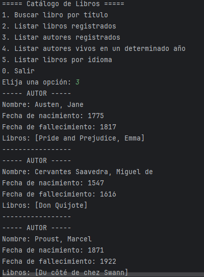

# LiterAlura

#### Challenge de ONE para práctica de SpringBoot, conexión con API y PostgreSQL.

##### El desafio consiste en un catálogo de libros en el cual un usuario puede registrar libros en una Base de Datos mediante una primer opción de busqueda, recibe una respuesta de la API que en este caso es "Gutendex", para más información leer la documentación: https://gutendex.com/, con la información sobre estos libros y una vez guardado en la Base de Datos se puede consultar dicha información de libros y autores registrados.
## Funcionamiento

##### Las 5 diferentes opciones para hacer son:
1. Buscar libro por título
2. Listar libros registrados
3. Listar autores registrados
4. Listar autores vivos en un determinado año
5. Listar libros por idioma

##### La primer opción te deja buscar un libro por titulo, si se encuentra en los registros de la API o alguno similar se guardará en nuesta propia BD. Validando que si ya existe no te permitirá agregarlo nuevamente para evitar duplicidad de datos. A continuación imagen de referencia:

##### Las siguientes 4 opciones son para la información ya almacenada en nuestra BD.
##### Listar libros registrados te hará una impresión en consola de los libros que has buscado y guardado, así como alguna información como lo es autor, idioma, numero de descargas. Imagen de referencia:

##### Listar autores registrados igualmente te hará una impresión en consola con la información de los autores de los libros que has agregado, Nombre, Fecha de nacimiento, Fecha de fallecimiento y los libros relacionados al autor.Imagen de referencia:

##### Listar autores vivos toma como referencia los datos de fechas de nacimiento y fallecimiento para mostrarte qué autores estaban vivos en un año que tú quieras saber. Imagen de referencia:

##### Listar libros por idioma te da la opción de escoger entre 4 idiomas: ingles, español, frances y portugues. Solo es necesario que imgreses dos letras como lo marca el submenu y mostrará en consola un listado de libros registrados en ese idioma. Imagen de referencia:

## Configuración

#### Al ser necesario Java Development Kit (JDK) 11 o superior al igual que Maven, como recomendación podrías abrir el proyecto desde un IDE Java como lo es IntelliJ IDEA o Eclipse.

#### De igual forma para la BD esta pensado con PostgreSQL, se recomienda la utilización de un gestor como pgAdmin.
#### En este caso es necesario crear una Base de Datos con el nombre que gustes. Una vez creada deberás ir al archivo `application.properties` y actualizar el archivo con tus credenciales de Base de Datos:
`spring.datasource.url=jdbc:postgresql://localhost:5432/tu_base_de_datos`
`spring.datasource.username=tu_usuario`
`spring.datasource.password=tu_contraseña`